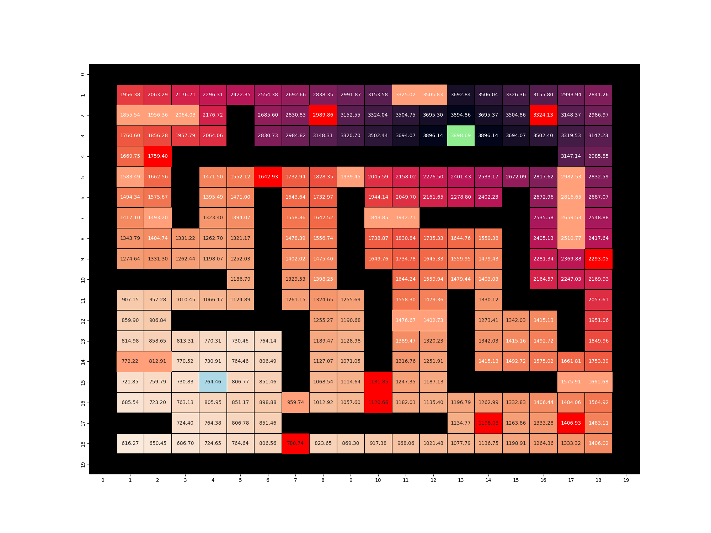
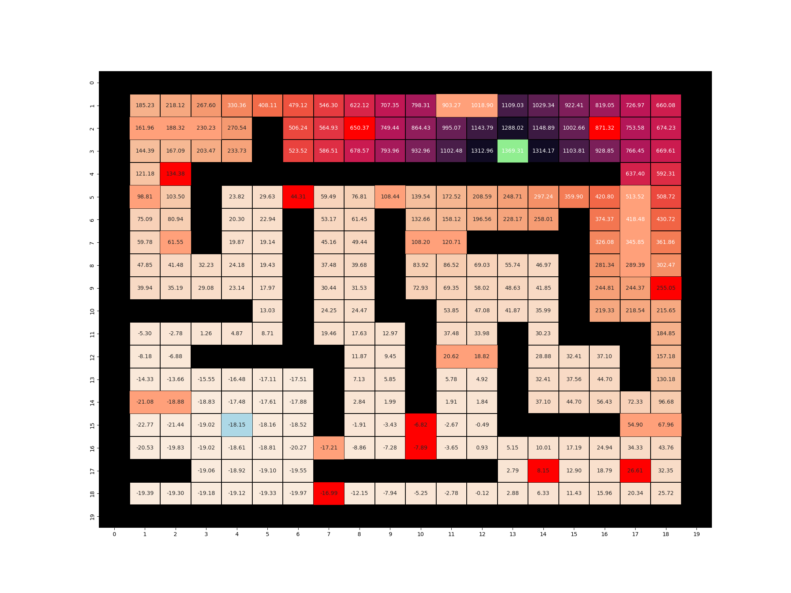
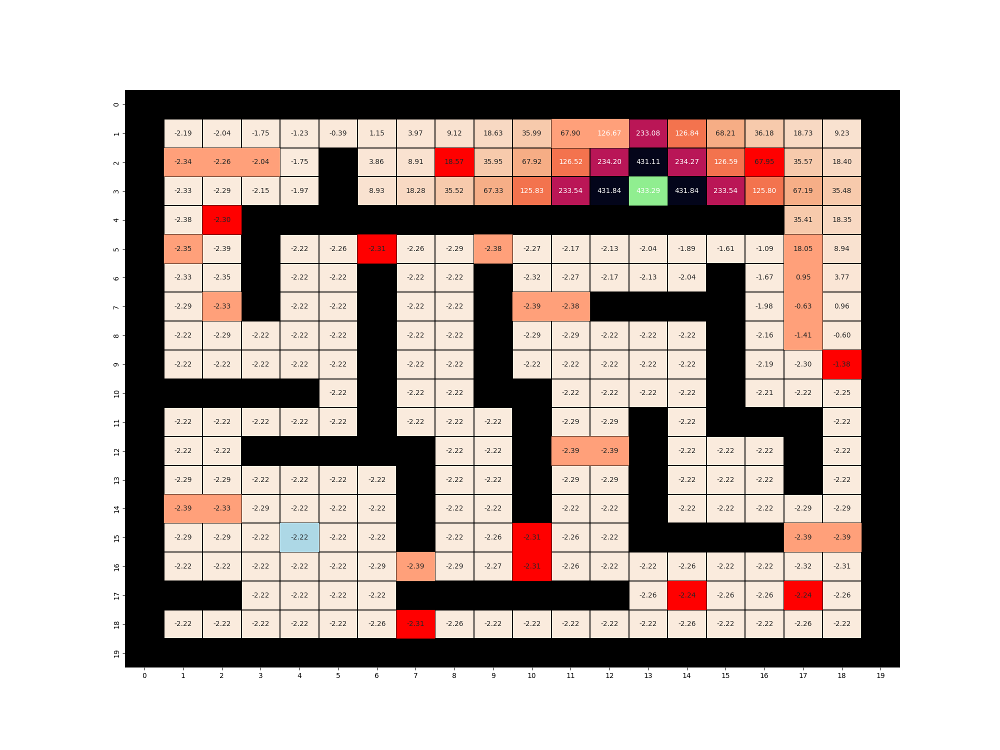
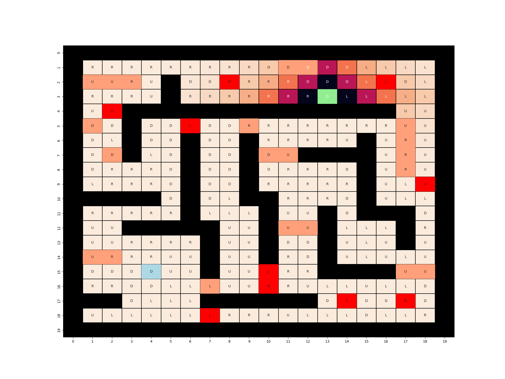

# Q1 Results compilation
## Plots
### Policy Iteration

Base Scenario:

Large Stochasticity Scenario:

Small Discount Factor Scenario:

### Value Iteration

Base Scenario:

Large Stochasticity Scenario:

Small Discount Factor Scenario:

## Observations:
In policy iteration method, in scenarios with larger gamma value, the policy from start position to goal position came out as correct. The paths were different. 

But in the case of small discount factor, since the gamma is less which means it is less reliant on future awards. Thus 'correct' policy stays only near few of cells near the goal state or state with highest reward. The policy from start state does not terminate in the goal state. The change in values decreases less and as the states go away from the goal state.

The path in large base case scenario is longer compared to larger stochastic scenario. In general it is seen that the accumulated reward at in large stochastic case is less compared to base case scenario. In large stochastic case the more oil states are hit, in base case more bump states are hit.

Same results were observed for value iteration method. 
